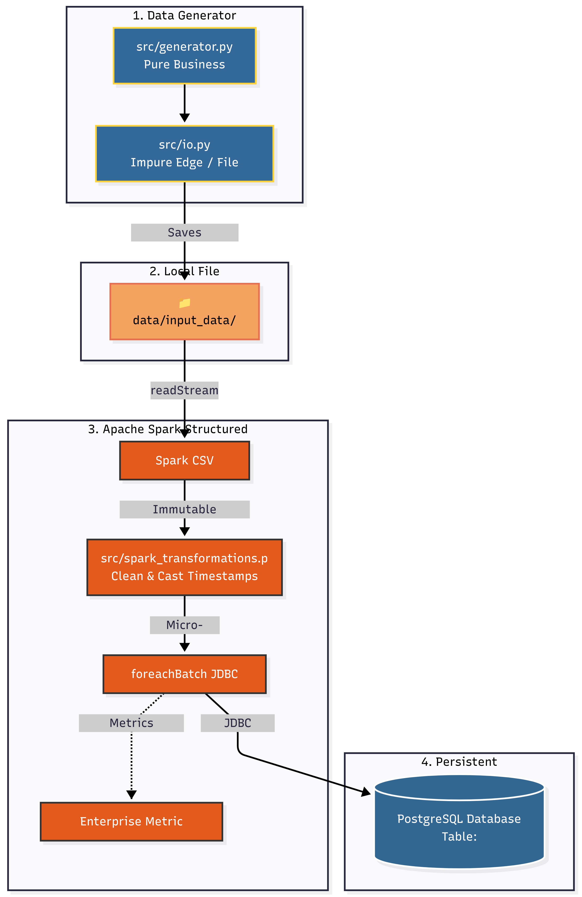

# Amalitech Streaming Lab: Real-Time E-commerce Simulator

Welcome to the **Amalitech Streaming Lab** project! This repository contains a real-time data streaming pipeline built with **PySpark Structured Streaming** and **Python**. It constantly generates simulated e-commerce events and processes them in micro-batches before sinking the cleansed data into a **PostgreSQL** database.

## System Architecture



## Overview

The application is divided into two main concurrent processes:
1. **Data Generator**: Continuously generates mock e-commerce transaction data (e.g., user events, product interactions) and stores them as CSV files in the `data/` directory.
2. **Spark Consumer Pipeline**: A PySpark Structured Streaming job that monitors the `data/` directory. It reads the incoming CSV files, validates the schema, applies data transformations (such as timestamp casting and adding processed timestamps), and writes the output directly to a PostgreSQL database.

## Prerequisites

- **Python 3.11+**
- **Docker & Docker Compose** (for running the PostgreSQL database)
- **Apache Spark** dependencies (configured to download necessary JDBC jars automatically)
- **uv** (Package manager, as indicated by the `uv.lock` file)

## Getting Started

### 1. Start the PostgreSQL Database
We provide a `docker-compose.yaml` to spin up the required PostgreSQL instance quickly.

```bash
docker-compose up -d
```

### 2. Install Dependencies
You can use `uv` to install the project dependencies cleanly:

```bash
uv pip install -r pyproject.toml
# Or alternatively, using standard Python:
pip install .
```

### 3. Run the E-Commerce Simulator and Pipeline
Starting the main entry point will spin up both the data generator and the PySpark streaming application in parallel.

```bash
python main.py
```

### 4. Stopping the Application
Press `Ctrl+C` in your terminal. The main orchestrator will catch the interrupt, shut down the data generator, and wait for the Spark streaming consumer process to terminate gracefully.

## Project Structure

- `main.py`: The entry point that orchestrates the generator and PySpark pipeline.
- `docker-compose.yaml`: Infrastructure definition for PostgreSQL.
- `system_architecture.png`: Diagram outlining the architecture of the project.
- `src/generator/`: Logic for mocking e-commerce data and writing CSV files.
- `src/streaming/`: The PySpark streaming application (Schema, Transformations, Pipeline, JDBC Sink).
- `src/config/`: Configuration loaders (TOML + `.env` overrides) and Spark Session setup.
- `tests/`: Pytest suite to ensure stability across modules.

## Testing

To run the unit tests across the generator and streaming modules:

```bash
uv run pytest
```

